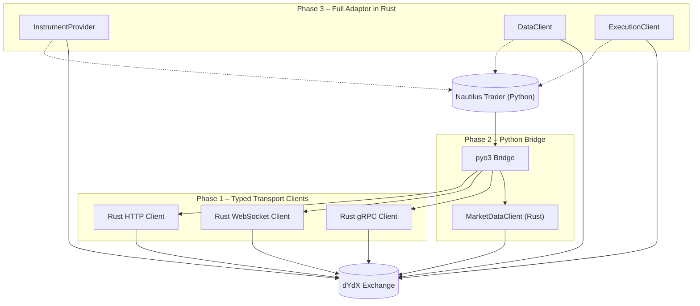

# dYdX Port Architecture Diagram

Below is a conceptual diagram showing how the dYdX port for Nautilus Trader is intended to work. It illustrates the three main phases from the implementation plan and the flow between Python and Rust components.

This diagram summarizes the planned progression:

1. **Phase 1** introduces typed transport clients in Rust for HTTP, WebSocket, and gRPC communication with dYdX.
2. **Phase 2** exposes these clients to Python via `pyo3`, routing market data through the Rust implementation.
3. **Phase 3** completes the port by implementing all adapter components in Rust, enabling Nautilus Trader to interact with dYdX end-to-end without Python in the critical path.
