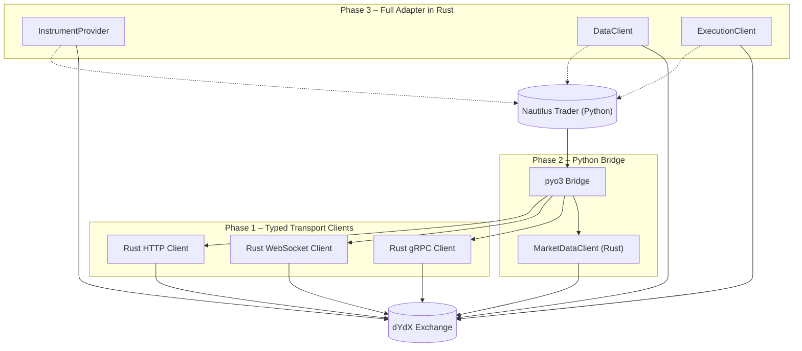

# nautilus-trader-dydx

This repository provides code and documentation for integrating dYdX with Nautilus Trader.

## dYdX API Components

The dYdX exchange exposes multiple APIs that serve distinct purposes:

- **HTTP (REST)** – used for retrieving historical market data and instrument metadata.
- **WebSocket** – provides streaming market data so clients can watch real-time order book updates and ticker changes.
- **gRPC** – required for submitting orders and requesting fee rates.

At present the project includes basic clients for each of these protocols. Future work will replace the current Python adapter with a set of strongly typed Rust implementations.

## Implementation Plan

Below is a high-level TODO list for the planned work:

- **Phase 1 – Core Typed Transport Clients**
  - Implement strongly typed Rust clients for HTTP (REST), WebSocket, and gRPC.
  - Add exhaustive tests and benchmarks.
  - Keep the existing Python adapter in place.
- **Phase 2 – Python Bridge & Market-Data Path**
  - Expose the Rust clients to Python using a lightweight `pyo3` layer.
  - Route the `MarketDataClient` so the current Python adapter transparently calls the Rust implementation.
  - Users should see lower latency with no application level changes.
- **Phase 3 – Full Adapter in Rust**
  - Re-implement `InstrumentProvider`, `DataClient`, and `ExecutionClient` entirely in Rust.
  - Refactor order submission with dedicated methods for short-term, long-term, and conditional orders.
  - Run soak and latency tests and publish example strategies and docs.

A practical approach is to begin development in a dedicated `dydx` crate that is kept outside the main production path. Once the crate stabilizes, we can replace the existing Python clients with their Rust equivalents. The final step is to implement the `InstrumentProvider`, `DataClient`, and `ExecutionClient` in Rust so the adapter runs end-to-end without Python.

## dYdX Port Architecture Diagram

Below is a conceptual diagram showing how the dYdX port for Nautilus Trader is intended to work. It illustrates the three main phases from the implementation plan and the flow between Python and Rust components.

This diagram summarizes the planned progression:

1. **Phase 1** introduces typed transport clients in Rust for HTTP, WebSocket, and gRPC communication with dYdX.
2. **Phase 2** exposes these clients to Python via `pyo3`, routing market data through the Rust implementation.
3. **Phase 3** completes the port by implementing all adapter components in Rust, enabling Nautilus Trader to interact with dYdX end-to-end without Python in the critical path.

## Repository Notes

The current adapter includes simple HTTP, WebSocket, and gRPC clients written in
Python. These will be replaced by typed Rust equivalents as development
progresses.

- Commit `84738a4` merged pull request `#1` titled "Add basic implementation plan".
- Pull request [#2610](https://github.com/nautechsystems/nautilus-trader/pull/2610)
  in the main Nautilus Trader repository demonstrates a similar port for the OKX
  exchange.
- No remote repository is configured for this project at present (`git remote -v`
  outputs nothing).

---

## Combined Documentation

### TODO for Rust Adapter Port

# TODO for Rust Adapter Port

This file tracks tasks required to implement a Rust-based adapter for NautilusTrader. See the [Developer Guide](https://nautilustrader.io/docs/latest/developer_guide/adapters/) for additional details on building an adapter.

## Adapter Components
- **Instrument Provider**: supply instrument definitions using Rust traits matching the Python `InstrumentProvider` behaviour.
- **Data Client**: manage custom data feeds not strictly related to market data.
- **Market Data Client**: provide market data such as order book deltas and instrument status.
- **Execution Client**: handle order submission, modification, cancellation, and report generation.
- **Configuration**: define settings required by the Rust clients (API keys, base URLs, etc.).

## dYdX API Notes
- The existing adapter already includes three transport clients:
  - **HTTP** for historical data and instrument metadata.
  - **WebSocket** for real-time market data streams.
  - **gRPC** for submitting orders and querying fee rates.
  These clients will be replaced with typed Rust equivalents during the port.

## Step-by-Step Porting Guide

1. **Set Up the Project**
   - Create a new Cargo workspace or `dydx` crate to host the Rust code.
   - Add dependencies such as `tokio`, `pyo3`, and serialization libraries.
   - Define a shared configuration module for API keys and base URLs.

2. **Implement Typed Transport Clients**
   - **HTTP Client**
     - Map REST endpoints for instrument metadata and historical data.
     - Implement typed request/response structs and authentication helpers.
     - Write unit tests covering error handling and edge cases.
   - **WebSocket Client**
     - Connect to the streaming endpoint and manage subscriptions.
     - Deserialize order book deltas and instrument status updates.
     - Provide a clean API for consumers to register callbacks.
   - **gRPC Client**
     - Compile the official proto files and generate Rust types.
     - Implement order submission and fee rate requests with retries.
     - Add tests to verify request formatting and response parsing.

3. **Expose Rust to Python**
   - Use `pyo3` (via `maturin` or `setuptools-rust`) to build Python bindings.
   - Wrap each client in a Python-friendly interface mirroring the existing adapter.
   - Validate the bindings with simple scripts that fetch data and submit orders.

4. **Reimplement Adapter Components in Rust**
   - Port the `InstrumentProvider`, `DataClient`, `MarketDataClient`, and `ExecutionClient` using Rust traits.
   - Ensure method names and behaviours match the Python versions for drop-in compatibility.
   - Integrate the transport clients from step 2 and the configuration module.

5. **Testing and Examples**
   - Mirror the Python adapter's behaviour with comprehensive unit and integration tests.
   - Provide example strategies that load instruments, stream market data, and place orders using the new Rust implementation.
   - Document environment variables and configuration files required for credentials.

Following these steps will gradually replace the current Python adapter with a fully typed Rust implementation while maintaining compatibility for existing Nautilus Trader users.

### Adapter Patterns Extracted from Repo

# Adapter Patterns Extracted from Repo

The repository mentions adapter-related patterns primarily in its planning and TODO documents. Key references include:

- **Keeping the Python adapter** while implementing typed Rust clients for HTTP, WebSocket, and gRPC. This is part of Phase 1 in the implementation plan.
- **Routing the MarketDataClient** through the Rust implementation so the current Python adapter transparently calls Rust code.
- **Full Adapter in Rust**, re-implementing InstrumentProvider, DataClient, and ExecutionClient entirely in Rust, and refactoring order submission methods.
- TODO instructions highlighting adapter components: Instrument Provider, Data Client, Market Data Client, Execution Client, and Configuration.
- Porting steps referencing reuse of typed transport clients, exposing the Rust API to Python via pyo3, and implementing tests mirroring Python adapter behavior.

The documentation does not mention Binance or Bybit specifically, but the repository describes a phased approach to porting adapter functionality from Python to Rust.

### dYdX API Notes

Also the earlier you can start digesting the dYdX API docs the better, it always takes a while to fully grasp these API's and dYdX is a little different with it being a DEX

### Expanded Notes on Order Submission Refactor and Project Context

# Expanded Notes on Order Submission Refactor and Project Context

This summary consolidates the documentation found in the repository and expands upon the planned refactoring work for Nautilus Trader's dYdX integration.

## Order Submission Refactor
The file `ORDER_REFACTOR_TODO.md` outlines a plan to split the current monolithic `submit_order` method into specialized functions:

- `submit_short_term_order(...)` for low latency intraday trading.
- `submit_long_term_order(...)` for swing or position strategies, including checks for funding rates or rollover.
- `submit_conditional_order(...)` triggered by price thresholds or other signals.

The refactor will extract shared logic (serialization, validation, error handling) into helper functions and update unit tests for each method. Once complete, the old `submit_order` method will be deprecated.

## Implementation Roadmap
According to `README.md`, the integration with dYdX is progressing through three phases:

1. **Core Typed Transport Clients** – Rust implementations for HTTP, WebSocket, and gRPC with exhaustive tests.
2. **Python Bridge & Market-Data Path** – expose the Rust clients via `pyo3` and route the `MarketDataClient` through them.
3. **Full Adapter in Rust** – re-implement `InstrumentProvider`, `DataClient`, and `ExecutionClient`, including the order submission refactor described above.

## References and Links
- The repository links back to the main Nautilus Trader project on GitHub: <https://github.com/nautechsystems/nautilus_trader>.
- PR [`#2610`](https://github.com/nautechsystems/nautilus_trader/pull/2610) introduces an OKX port serving as a reference architecture.
- PR [`#1951`](https://github.com/nautechsystems/nautilus_trader/pull/1951) describes earlier porting work used as a template here.

These links provide context for how the dYdX port and the order submission refactor fit into the broader Nautilus Trader development roadmap.

### Links to Remote Repository

This file lists links to relevant adapter patterns and pull requests in the main Nautilus Trader repository.

- Main repository: https://github.com/nautechsystems/nautilus_trader
- dYdX adapter planning: [PR #1951](https://github.com/nautechsystems/nautilus_trader/pull/1951)
- OKX port PR example: [PR #2610](https://github.com/nautechsystems/nautilus_trader/pull/2610)

Additional modules for existing adapters can be found in the `nautilus_trader/adapters` directory of the main repository.

### OKX Port Documentation

# OKX Port Documentation

This document outlines a proposed plan to port Nautilus Trader to support the OKX exchange. The steps mirror the approach for the existing dYdX port (see PR #1951 in the main repository) and expand with additional details.

## Overview
- **Objective**: Provide a full-featured adapter for the OKX exchange using the same architecture as the dYdX port.
- **Approach**: Implement typed transport clients in Rust, expose them through `pyo3` to Python, and gradually replace the current Python OKX adapter.

## Step-by-Step Process

### 1. Gather Requirements
1. Review the existing dYdX adapter implementation and the architecture defined in [PR #1951](https://github.com/nautechsystems/nautilus_trader/pull/1951).
2. Document OKX-specific API endpoints, authentication methods, and WebSocket channels.
3. Identify any differences from dYdX in order types, rate limits, and market data feeds.

### 2. Set Up Rust Crates
1. Create new Rust crates for `okx_http`, `okx_ws`, and `okx_grpc` based on the dYdX transport clients.
   - Each crate should expose a lightweight asynchronous API built on `reqwest` and `tokio`.
   - Include reusable error types so failures are handled consistently across the adapter.
2. Implement strongly typed request/response structs matching the OKX API.
   - Model WebSocket channels as enum variants with precise payload structs.
   - Provide conversion helpers to map between OKX order formats and the internal Nautilus Trader types.
3. Provide exhaustive unit tests and benchmarks for each client.
   - Use mocked servers to ensure deterministic test behaviour.
   - Benchmark the core serialization and network routines to catch regressions early.

### 3. Expose Rust APIs to Python
1. Use `pyo3` to generate Python bindings for the Rust transport clients.
2. Ensure the build system compiles these bindings as part of the Python package.
3. Validate the bindings with example scripts that exercise REST and WebSocket calls.

### 3a. Rust Port Guidelines
1. Organize each crate with a clear module hierarchy separating models, clients, and utilities.
2. Favor asynchronous tasks to maximize throughput when streaming market data or submitting orders.
3. Where possible, mirror the method names and semantics of the existing Python adapter so the higher-level logic remains unchanged.
4. Document each public function with examples to guide future contributors.

### 4. Implement Adapter Components in Rust
1. Recreate `InstrumentProvider`, `MarketDataClient`, `DataClient`, and `ExecutionClient` in Rust, mirroring the dYdX port structure.
2. Integrate the typed transport clients from step 2.
3. Provide configuration management for API keys, base URLs, and timeouts.

### 5. Bridge to Python
1. Replace the current Python OKX adapter methods with calls to the Rust implementations via the `pyo3` bindings.
2. Maintain compatibility with existing Nautilus Trader interfaces to minimize breaking changes.
3. Add integration tests ensuring orders and market data flow correctly through the new adapter.

### 6. Update Examples and Documentation
1. Provide Python examples demonstrating how to configure and use the OKX adapter.
2. Document environment variables or configuration files required for credentials.
3. Outline troubleshooting steps for common issues (connection drops, order rejections, etc.).

### 7. Final Testing and Deployment
1. Run soak tests to monitor stability under real market conditions.
2. Collect latency metrics and compare them with the existing Python adapter.
3. Publish the adapter on PyPI (or the relevant package index) and update Nautilus Trader docs to reflect OKX support.

## Notes
- The full port requires careful review of OKX's API rate limits and order handling specifics.
- Following the pattern from the dYdX port ensures consistency across exchanges and simplifies future maintenance.
- Additional pull requests may refine logging, metrics, or optional features such as advanced order types.

### Order Submission Refactor TODO

# Order Submission Refactor TODO

This document collects notes for future refactoring of the order submission flow. The goal is to split logic into dedicated methods based on order duration and conditional triggers.

## Overview
- **Short-term Orders**: Designed for high frequency or intraday trading. These methods should focus on low latency submission and may include options for immediate cancellation if not filled quickly.
- **Long-term Orders**: Suitable for swing or position trades. They may require additional validation around funding rates or rollover mechanisms.
- **Conditional Orders**: Triggered when specific market conditions are met, such as price thresholds, indicators, or external signals. These methods should handle the evaluation of conditions and ensure correct order placement when triggered.

## Proposed Steps
1. Review current `ExecutionClient` API to identify shared logic between order types.
2. Design new method signatures:
   - `submit_short_term_order(...)`
   - `submit_long_term_order(...)`
   - `submit_conditional_order(...)`
3. Extract common components (serialization, validation, error handling) into private helper functions.
4. Update unit tests to cover each method independently.
5. Deprecate the existing monolithic `submit_order` method after migration.

The timeline for this work is flexible. Feedback is welcome through PR review since direct coding time is limited.

### Information on Nautilus Trader dYdX Port

# Information on Nautilus Trader dYdX Port

This repository `nautilus-trader-dydx` currently contains a minimal README documenting a proposed implementation plan.

## Implementation Plan
The README outlines a three-phase approach:
1. **Core Typed Transport Clients** – implement Rust clients for HTTP (REST), WebSocket, and gRPC with tests and benchmarks while keeping the existing Python adapter.
2. **Python Bridge & Market-Data Path** – expose Rust clients to Python via `pyo3` and route the `MarketDataClient` through the Rust implementation, transparently for users.
3. **Full Adapter in Rust** – re-implement `InstrumentProvider`, `DataClient`, and `ExecutionClient` in Rust, refactor order submission methods, and run latency and soak tests.

### Existing dYdX Clients
The current adapter already provides three separate transport clients:
- **HTTP** – used for historical data queries and instrument metadata.
- **WebSocket** – streams market data such as order book updates.
- **gRPC** – required for order submission and fee rate requests.
These will be replaced by strongly typed Rust equivalents as work progresses.

## References and Links
- The README indicates that this repository integrates dYdX with Nautilus Trader.
- Commit `84738a4` references a merge of pull request `#1` titled "Add basic implementation plan".
- Pull request [`#2610`](https://github.com/nautechsystems/nautilus-trader/pull/2610) introduces a new OKX port for Nautilus Trader.
- The commit history does not reference other repositories or PRs with additional details.
- There are no other files or documentation in this repository at this time.

## Notes on NR Repository Links
The user request mentions "links to NR repo" with details on PRs and files. No remote repository is configured (`git remote -v` shows none), and no additional references exist in commit messages or documentation. As a result, detailed links to PRs or files in an external NR repository could not be provided from the data available within this repository.

### Rust-only Work for dYdX Port

# Rust-only Work for dYdX Port

The following table and notes outline the Rust-centric tasks required to complete the
`nautilus-trader-dydx` port. These items are derived from the project's implementation plan
and provide a more detailed breakdown of the work ahead.

### "Rust-only" deliverables

| Layer | Concrete Rust deliverables | Notes / acceptance tests |
| --- | --- | --- |
| **1. Transport clients (Phase 1)** | *HTTP (REST) client* • Hand-rolled `Reqwest` / `hyper` wrapper with HMAC-SHA256 signing helper • Strongly-typed request / response structs for every dYdX v4 REST route (markets, orderbook snapshots, fills, funding, etc.)  *WebSocket client* • `tokio-tungstenite` stream that yields an enum `MarketStreamMsg` covering order-book deltas, trades, tickers, heartbeats • Automatic ping/pong/ reconnect with exponential back-off  *gRPC client* • `tonic-build` code-gen from official proto files • Wrapper that maps proto types ⇄ idiomatic Rust domain types (`OrderId`, `FeeRate`, …) | Criterion benches for each client (latency & throughput). Property tests (`proptest`) for JSON <-> struct round-trips. |
| **2. Error & retry framework** | • Unified `enum DydxTransportError` implementing `thiserror::Error` • A `RetryPolicy` trait with concrete `ExponentialBackoff` impl reused by all three clients | Must bubble up *only* typed errors to callers; no `anyhow` leaks. |
| **3. `dydx` crate API surface** | • Public façade module exporting `HttpClient`, `WsClient`, `GrpcClient` + `DydxConfig` builder • Feature flags: `rustls`/`native-tls`, `async-std` runtime | Zero `unsafe` in safe API. |
| **4. Python bridge (Phase 2)** | • `pyo3` + `maturin` bindings that expose: `PyHttpClient`, `PyWsClient`, `PyMarketDataClient` • Internal async executor management (either reuse Nautilus’ runtime via `tokio::runtime::Handle::current()` or spin a dedicated multi-thread) | Round-trip test from Python: subscribe to BTC-USD order-book and assert first delta < 200 ms from handshake. |
| **5. Instrument & metadata layer** | • `InstrumentProvider` in Rust: maps dYdX “markets” JSON → `Instrument` struct (symbol, base/quote, tick size, lot size, …). • In-memory LRU cache + TTL invalidation. | Unit tests with a fixed JSON fixture for every market type. |
| **6. Market-data path** | • `DataClient` that stitches `WsClient` streaming + snapshot sync from `HttpClient` into a *single* coherent `BookEvent` feed (price-level upserts, checksums). | Fuzz with random insert/delete seeds; verify order-book checksum equals exchange checksum every N packets. |
| **7. Execution path** | • `ExecutionClient` (pure Rust, using gRPC)   – Dedicated high-level methods:   `send_short_term`, `send_long_term`, `send_conditional` (see *ORDER_REFACTOR_TODO*)   – In-flight order tracker with  ✕timeouts &  ✅fills • Post-trade fee lookup (`GrpcClient::query_fee_rates`) | Integration test: place IOC order on test-net, assert ACK, FILL or CANCEL in < 1 s. |
| **8. Adapter glue (Phase 3)** | • Replace Python adapter plumbing with: `RustInstrumentProvider`, `RustDataClient`, `RustExecutionClient` registered via Nautilus “service locator”. • Conditional `#[cfg(feature = "full_rust")]` to compile old path out. | End-to-end soak test: 24 h test-net run with synthetic strategy; memory leak < 1 MB/h growth. |
| **9. Tooling & CI** | • `cargo xtask` for code-gen, proto re-gen, lint, bench • GitHub Actions matrix: Linux/macOS, nightly/stable, `--release` benches | Benches must upload HTML flamegraphs to Workflow artifacts. |
| **10. Docs & examples** | • `docs/` mdbook chapter *“Building high-performance crypto adapters in Rust”* • Example Jupyter notebook (via the pyo3 wheel) streaming live order book into pandas | Notebook must run under GitHub Codespaces. |

---

### Recommended development sequencing

1. **Sprint 1 (1–2 weeks)** – bootstrap `dydx` crate, implement REST `Time` + `Markets` endpoints, finish error design.
2. **Sprint 2** – WebSocket delta stream & order-book builder; release `v0.1.0-alpha`.
3. **Sprint 3** – gRPC order placement + fee lookup; load tests.
4. **Sprint 4** – pyo3 bridge, wire into existing Python `MarketDataClient`; latency comparison benchmark.
5. **Sprint 5** – port Instrument / Data / Execution clients; remove Python path under `full_rust` feature.
6. **Sprint 6** – order-submission refactor, soak tests, publish examples & docs; tag `v1.0.0`.

### Key design principles

* **Zero copy, zero allocation** where possible (e.g. borrow `&[u8]` WebSocket frames, parse with `serde_json::from_slice` into `Cow<'_, str>`).
* **Tokio everywhere** – keeps a single runtime for REST, WS and gRPC.
* **No global singletons** – pass `Arc<…>` configs; eases multi-exchange use.
* **Typed guarantees at compile-time** – separate new-types for `UsdPrice`, `BaseQty`, `QuoteQty` to avoid unit mix-ups.
* **Feature-flagged crates** so Nautilus users can opt-in only to integrations they need.

These items outline the Rust-focused path to complete the dYdX integration.

