<!-- 1 · Component & Dependency Architecture -->
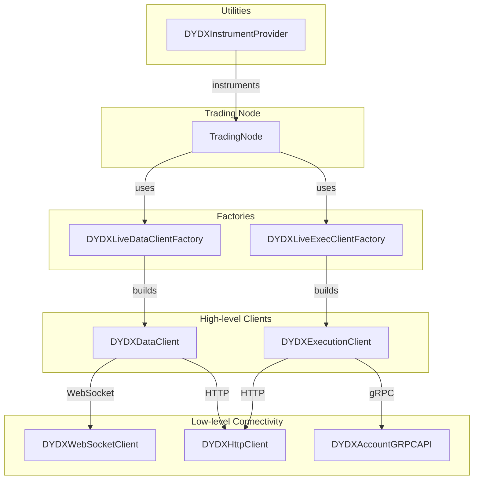


<!-- 3 · End-to-End Order Submission Sequence -->
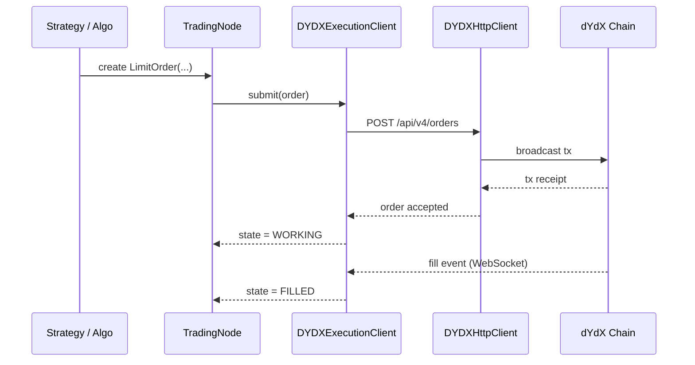


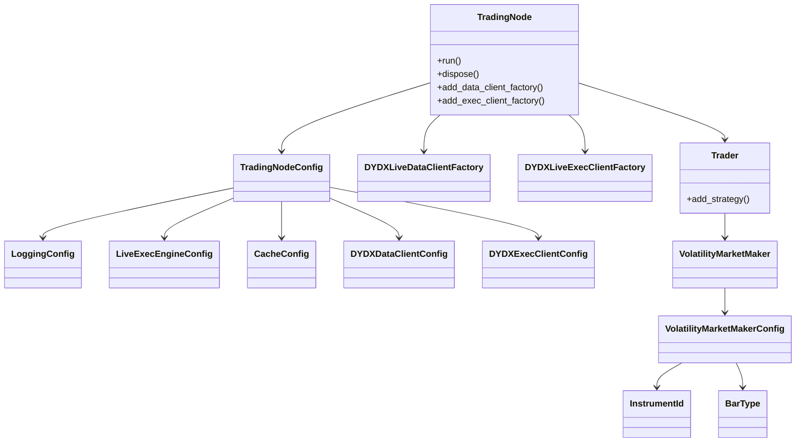

```md
nautilus_trader/
└── adapters/
    └── dydx/
        ├── __init__.py          ◀─ ENTRY-POINT (re-exports everything below)
        ├── factories.py         ◀─ DYDXLiveDataClientFactory / DYDXLiveExecClientFactory
        ├── data.py              ◀─ DYDXDataClient
        ├── execution.py         ◀─ DYDXExecutionClient
        ├── websocket/client.py  ◀─ DYDXWebsocketClient
        ├── http/client.py       ◀─ DYDXHttpClient
        ├── grpc/account.py      ◀─ DYDXAccountGRPCAPI
        ├── providers.py         ◀─ DYDXInstrumentProvider
        └── … (configs, enums, etc.)
```


Below are the seven Mermaid diagrams wrapped in Markdown code-blocks, ready to paste straight into any renderer that supports Mermaid.

### 1 · Package / module overview

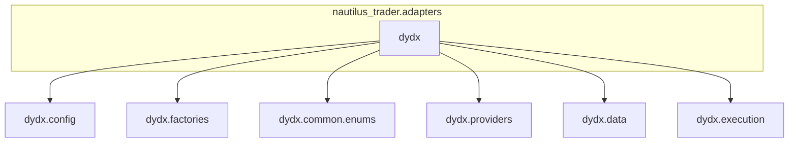

### 2 · Config module

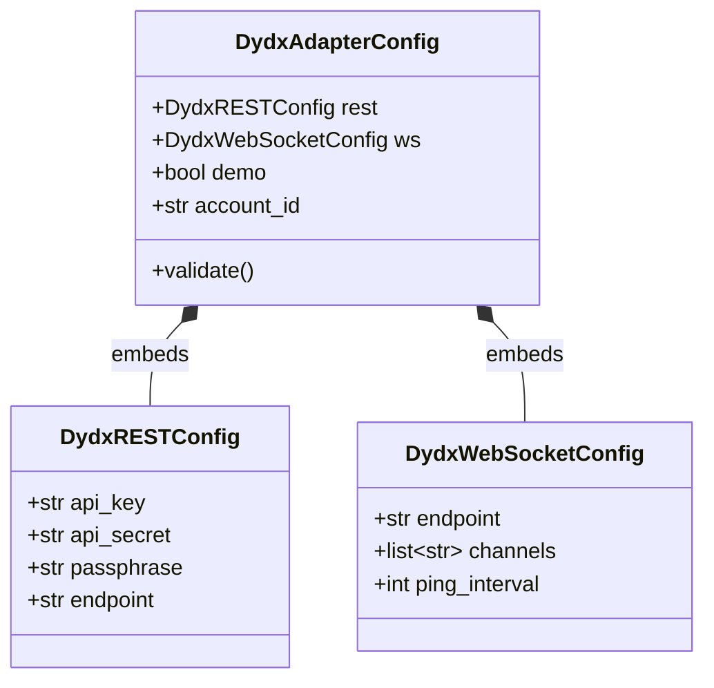

### 3 · Factories module

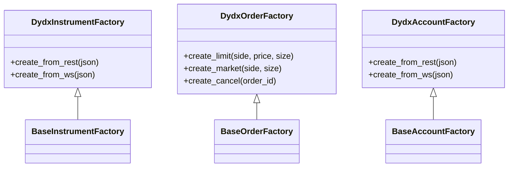

### 4 · Enums module

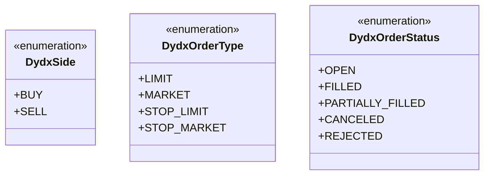

### 5 · Providers module

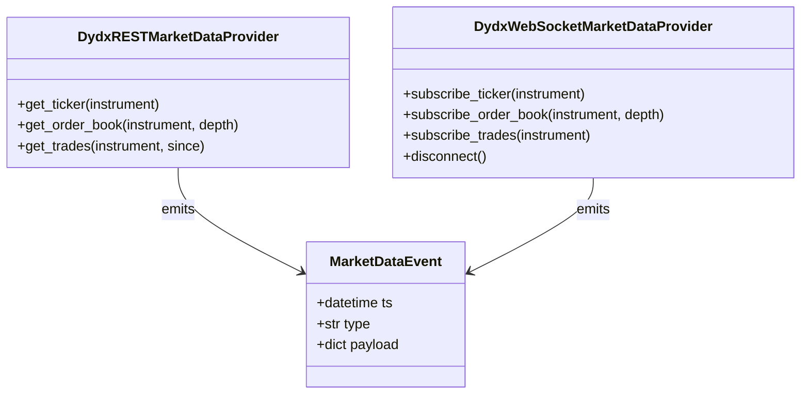

### 6 · Data module

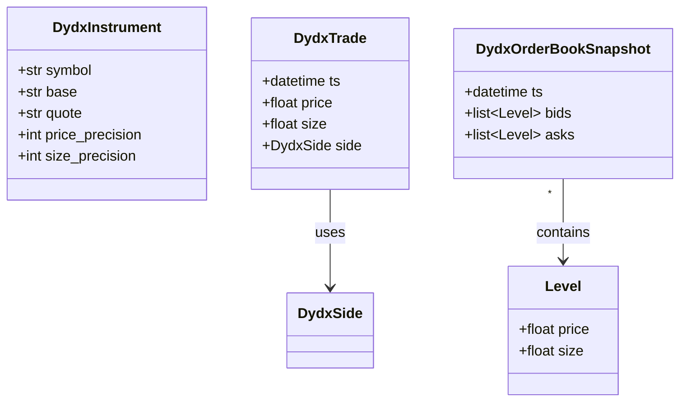

### 7 · Execution module

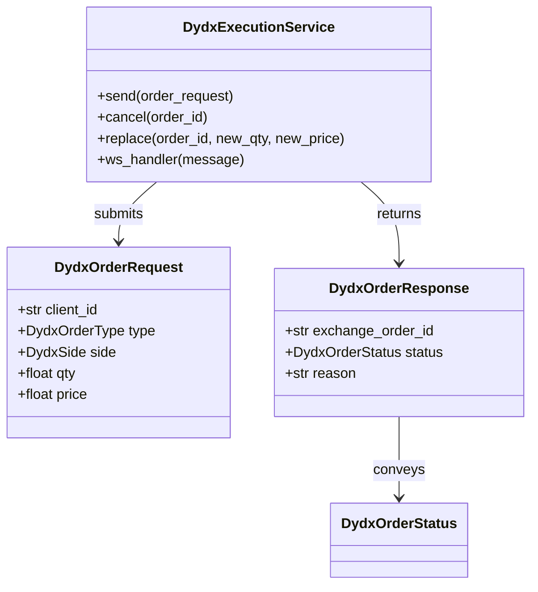

##### 1. File-/Module-level map (flowchart TD)

```mermaid
flowchart TD
    subgraph "nautilus_trader.adapters.dydx"
        A[__init__.py<br/>(re-exports)]
        B[config.py<br/>DydxConfig]
        C[common/*<br/>constants & helpers]
        D[endpoints/*<br/>(URL builders)]
        E[http/*<br/>HTTP client]
        F[websocket/*<br/>WS client]
        G[schemas/*<br/>Pydantic ↔ core]
        H[data.py<br/>Market-data adapters]
        I[execution.py<br/>Order logic]
        J[factories.py<br/>DydxAdapterFactory]
        K[providers.py<br/>DydxExchangeAdapter]
    end

    A --> K
    J --> K
    K --> B
    K --> C
    K --> D
    K --> E
    K --> F
    K --> G
    K --> H
    K --> I
    D --> E
    D --> F
```

##### 2. Runtime initialisation (sequence diagram)

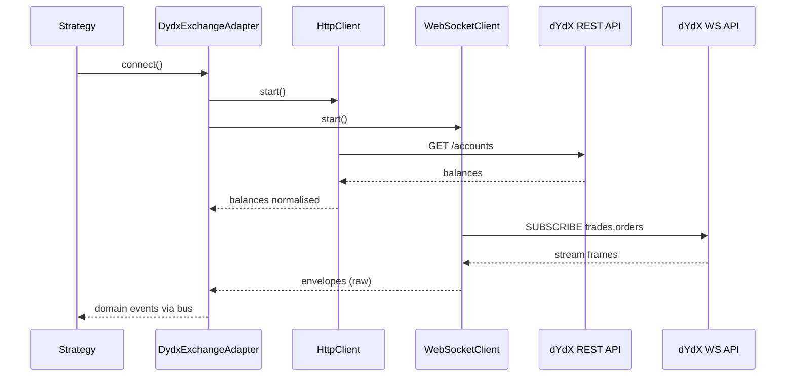

##### 3. Live data / order-flow (left-to-right flowchart)

```mermaid
flowchart LR
    subgraph "dYdX"
        A1[WebSocket stream] -->|JSON frames| B1[Deserializer]
        A2[REST endpoint] ---.
    end

    B1 --> C[Normalizer<br/>(schemas/*)]
    A2 -.-> C

    C --> D[MessageBus]
    D --> E[Strategy]
    E --> F[OrderIntent]
    F --> G[OrderRouter<br/>(execution.py)]
    G --> H[HttpClient] & I[WebSocketClient]
    H -->|REST: place order| A2
    I -->|WS: private| A1
    D <-- G
```

```mermaid
graph TD
    %% ────── dYdX adapter entry-point ──────
    EP["nautilus_trader.adapters.dydx<br/>__init__.py<br/>(entry-point)"]

    EP --> F1[DYDXLiveDataClientFactory]
    EP --> F2[DYDXLiveExecClientFactory]
    EP --> C1[DYDXDataClientConfig]
    EP --> C2[DYDXExecClientConfig]
    EP --> P[DYDXInstrumentProvider]

    %% ────── Factories build clients ──────
    subgraph "Factory build-time graph"
        F1 --> DC[DYDXDataClient]
        F2 --> EC[DYDXExecutionClient]

        DC --> HC[DYDXHttpClient]
        DC --> WS[DYDXWebsocketClient]

        EC --> HC
        EC --> WS
        EC --> GRPC[DYDXAccountGRPCAPI]

        DC --> P
        EC --> P
    end

    %% ────── Typical live script wiring ──────
    MM["examples/live/dydx/<br/>dydx_market_maker.py"] --> TN[TradingNode]
    TN -->|add_data_client_factory("DYDX", …)| F1
    TN -->|add_exec_client_factory("DYDX", …)| F2
```
##### 1. File-/Module-level map

```mermaid
flowchart TD
    subgraph "nautilus_trader.adapters.dydx"
        A[__init__.py<br/>(re-exports)]
        B[config.py<br/>DydxConfig]
        C[common/*<br/>constants & helpers]
        D[endpoints/*<br/>(URL builders)]
        E[http/*<br/>HTTP client]
        F[websocket/*<br/>WebSocket client]
        G[schemas/*<br/>Pydantic ↔ core]
        H[data.py<br/>Market-data adapters]
        I[execution.py<br/>Order logic]
        J[factories.py<br/>DydxAdapterFactory]
        K[providers.py<br/>DydxExchangeAdapter]
    end

    A --> K
    J --> K
    K --> B
    K --> C
    K --> D
    K --> E
    K --> F
    K --> G
    K --> H
    K --> I
    D --> E
    D --> F
```

##### 2. Runtime initialisation

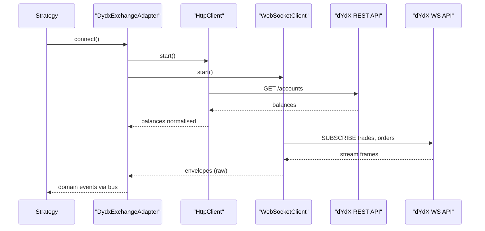

##### 3. Live data & order-flow

```mermaid
flowchart LR
    subgraph "dYdX"
        A1[WebSocket stream] -->|JSON frames| B1[Deserializer]
        A2[REST endpoint]
    end

    B1 --> C[Normalizer<br/>(schemas/*)]
    A2 -.-> C

    C --> D[MessageBus]
    D --> E[Strategy]
    E --> F[OrderIntent]
    F --> G[OrderRouter<br/>(execution.py)]
    G --> H[HttpClient]
    G --> I[WebSocketClient]
    H -->|REST place order| A2
    I -->|WS private| A1
    G --> D
```


