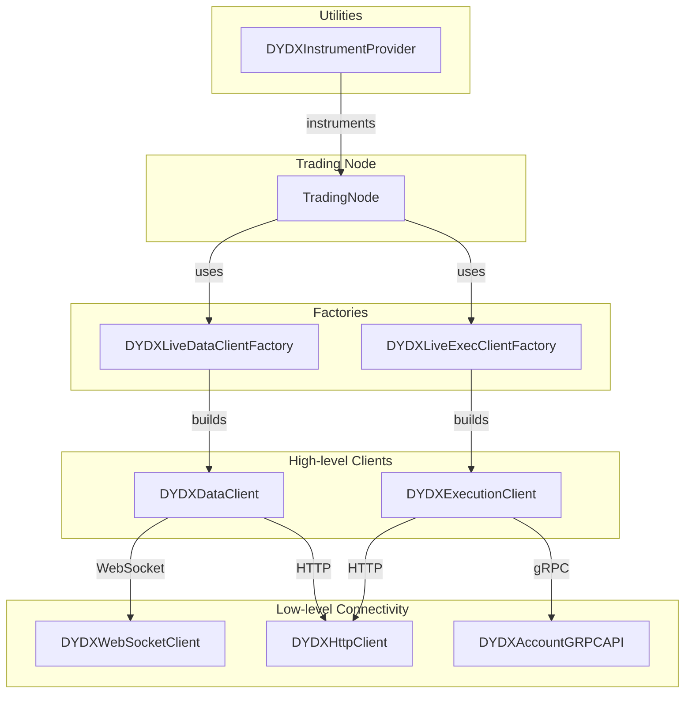
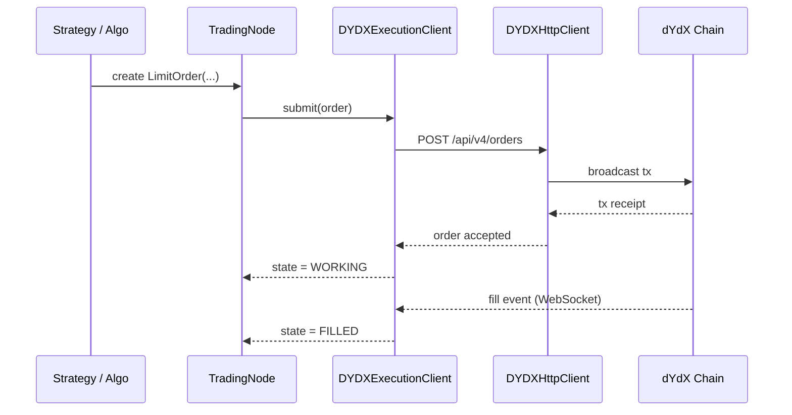
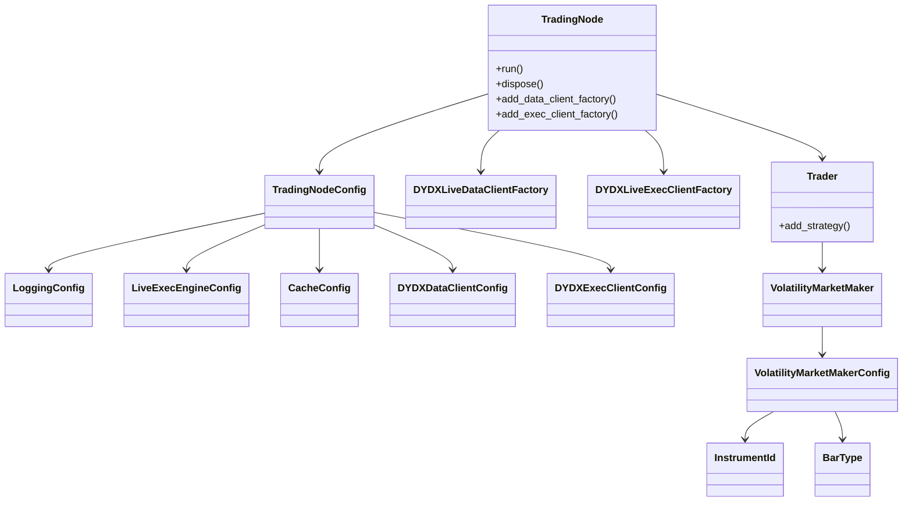

<!-- 1 · Component & Dependency Architecture -->


<!-- 2 · Order Classification & Life-cycle -->
```mermaid
flowchart TD
    A[New Order] -->|default| B[Short-term<br>(in-block)]
    A -->|DYDXOrderTags<br>is_short_term_order = false| C[Long-term]

    %% short-term branch
    B -->|optional: num_blocks_open| B1[Expires after N blocks]
    B --> B2[Committed only<br>fill & expiry]

    %% long-term branch
    C --> D{Conditional?}
    D -->|Yes&nbsp;(STOP_*)| C1[Long-term<br>Conditional]
    D -->|No| C2[Long-term<br>Regular]

    %% terminal
    B1 & B2 & C1 & C2 --> E[Filled / Cancelled / Expired]
```

<!-- 3 · End-to-End Order Submission Sequence -->




nautilus_trader/
└── adapters/
    └── dydx/
        ├── __init__.py          ◀─ ENTRY-POINT (re-exports everything below)
        ├── factories.py         ◀─ DYDXLiveDataClientFactory / DYDXLiveExecClientFactory
        ├── data.py              ◀─ DYDXDataClient
        ├── execution.py         ◀─ DYDXExecutionClient
        ├── websocket/client.py  ◀─ DYDXWebsocketClient
        ├── http/client.py       ◀─ DYDXHttpClient
        ├── grpc/account.py      ◀─ DYDXAccountGRPCAPI
        ├── providers.py         ◀─ DYDXInstrumentProvider
        └── … (configs, enums, etc.)
