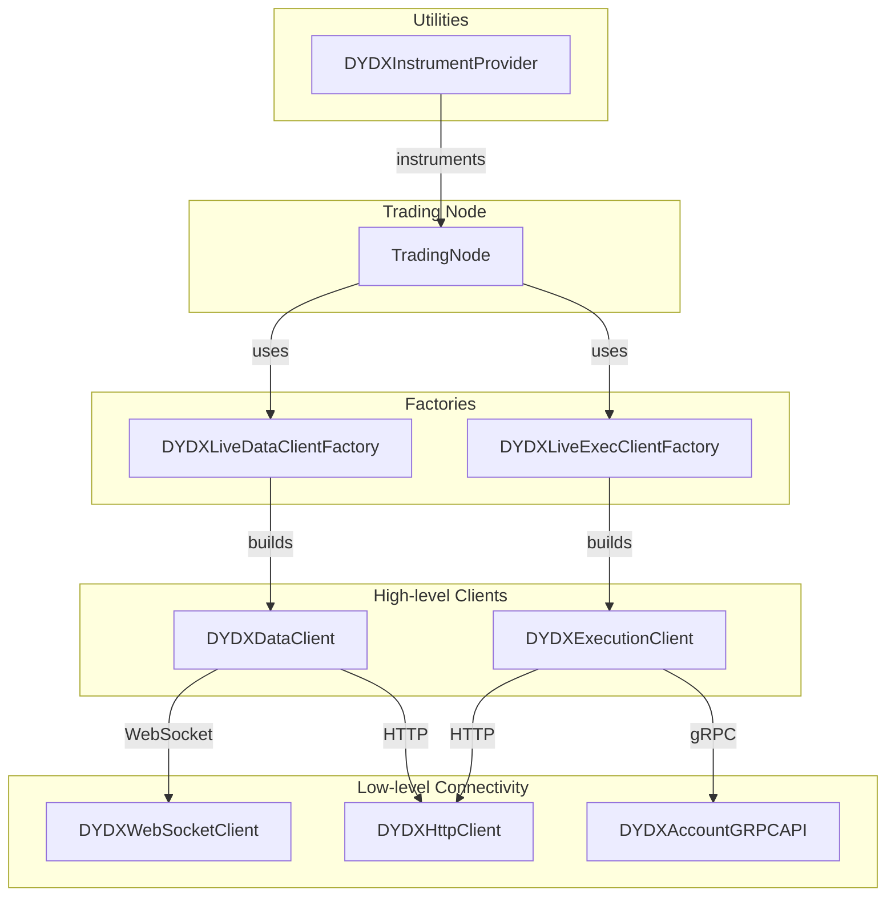
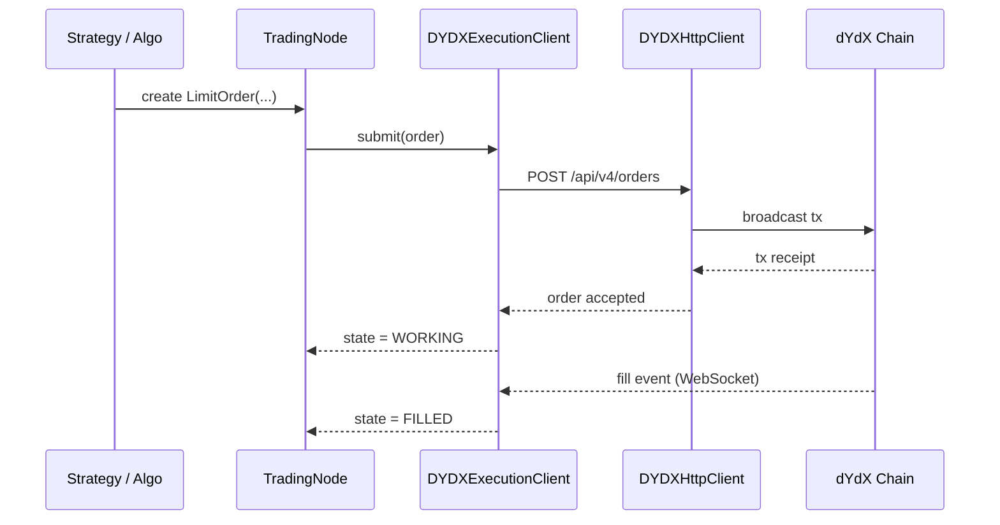
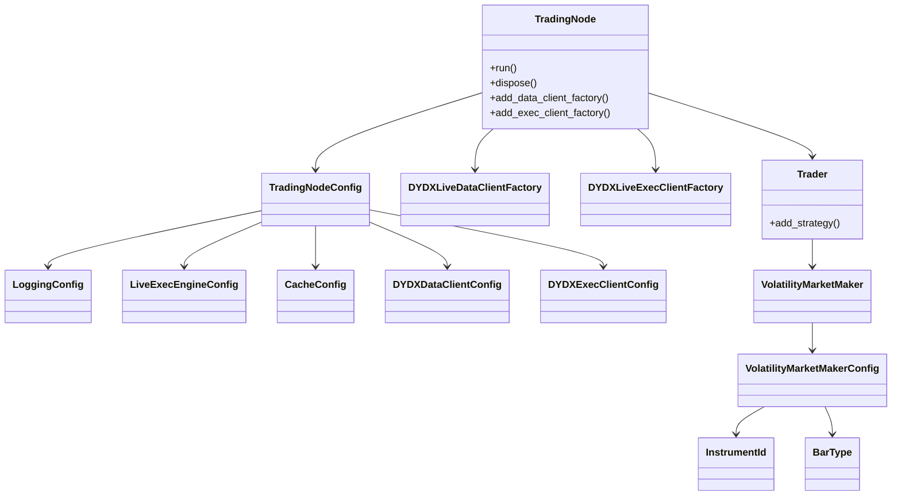
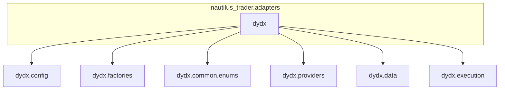
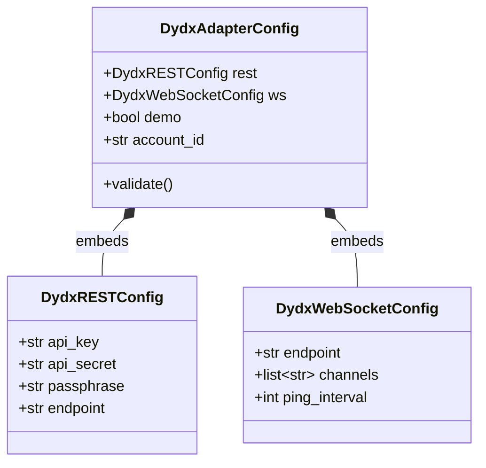
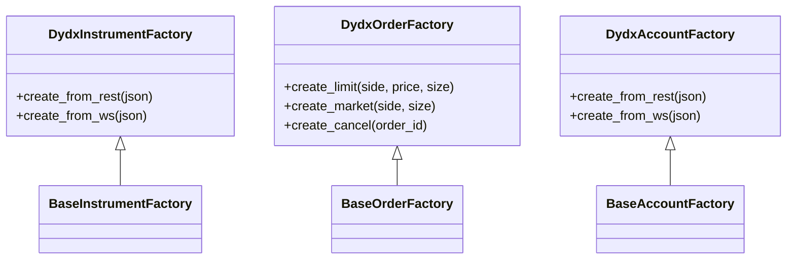
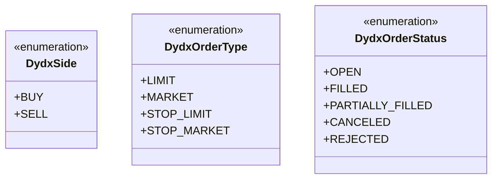
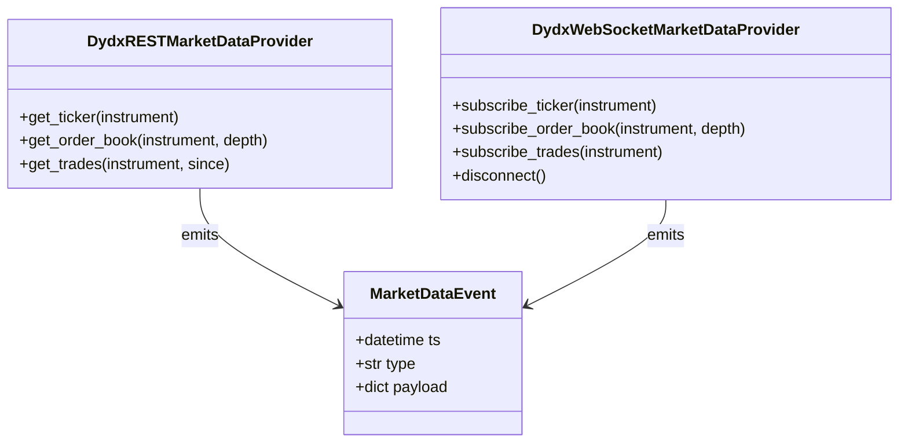
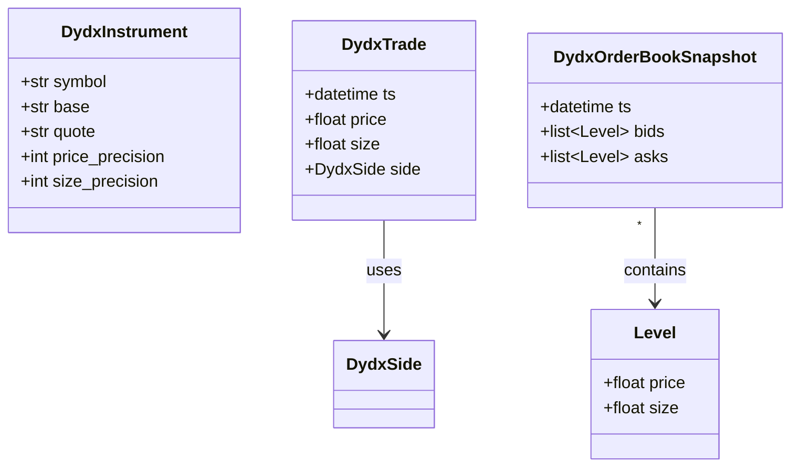
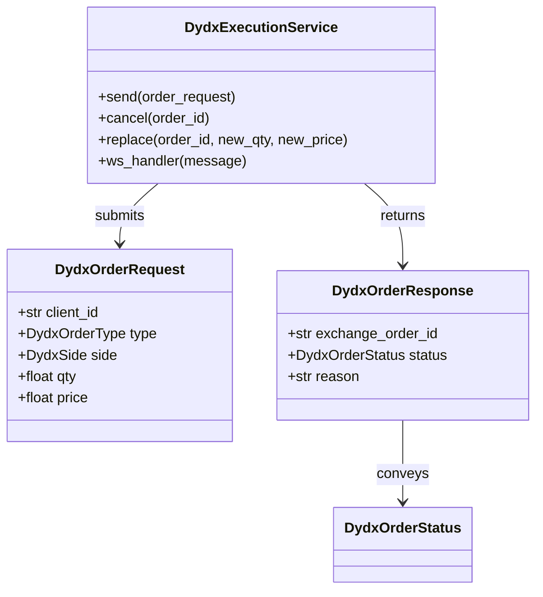

<!-- 1 · Component & Dependency Architecture -->



<!-- 3 · End-to-End Order Submission Sequence -->





```md
nautilus_trader/
└── adapters/
    └── dydx/
        ├── __init__.py          ◀─ ENTRY-POINT (re-exports everything below)
        ├── factories.py         ◀─ DYDXLiveDataClientFactory / DYDXLiveExecClientFactory
        ├── data.py              ◀─ DYDXDataClient
        ├── execution.py         ◀─ DYDXExecutionClient
        ├── websocket/client.py  ◀─ DYDXWebsocketClient
        ├── http/client.py       ◀─ DYDXHttpClient
        ├── grpc/account.py      ◀─ DYDXAccountGRPCAPI
        ├── providers.py         ◀─ DYDXInstrumentProvider
        └── … (configs, enums, etc.)
```


Below are the seven Mermaid diagrams wrapped in Markdown code-blocks, ready to paste straight into any renderer that supports Mermaid.

### 1 · Package / module overview



### 2 · Config module



### 3 · Factories module



### 4 · Enums module



### 5 · Providers module



### 6 · Data module



### 7 · Execution module


