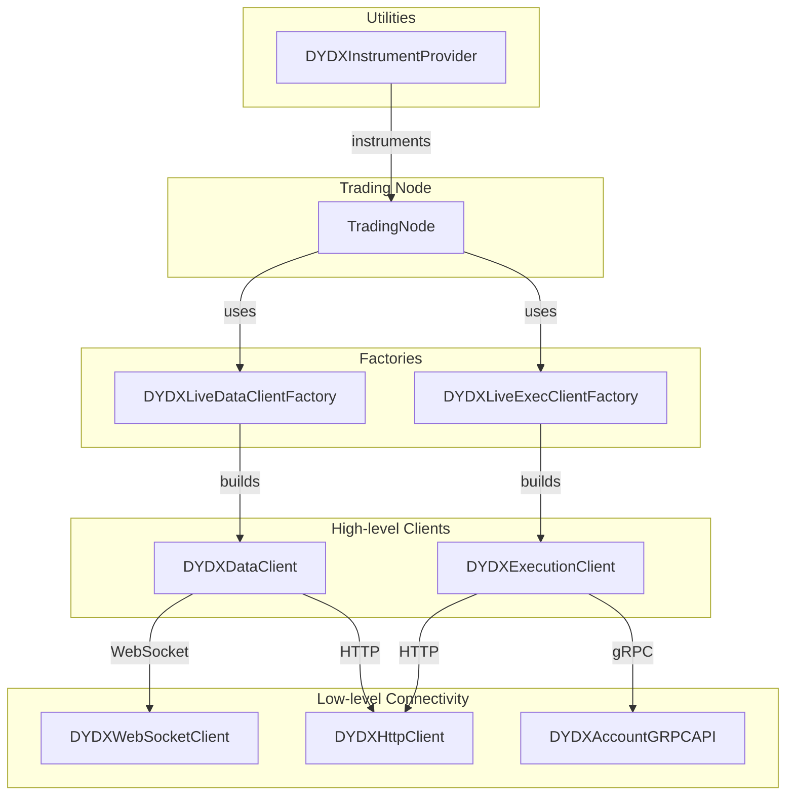
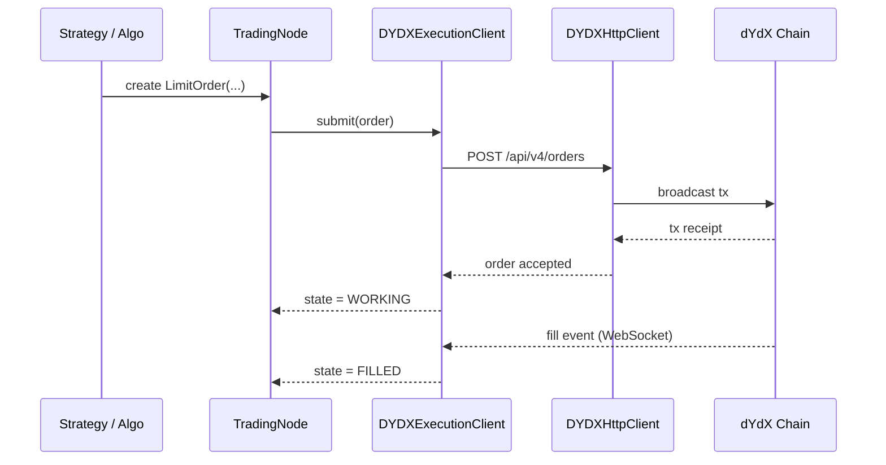
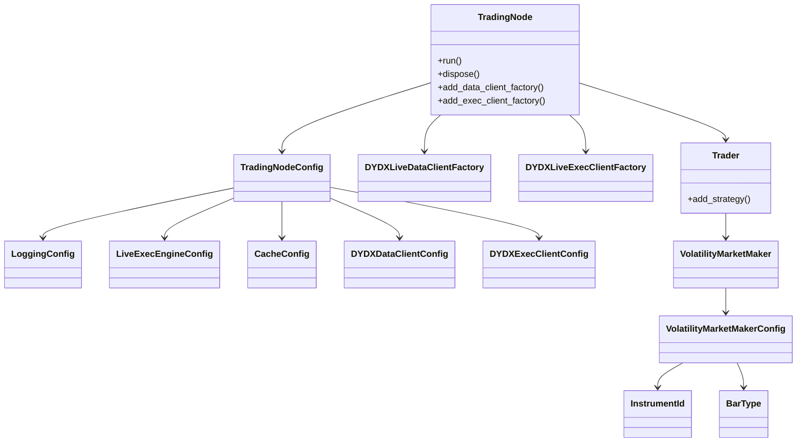
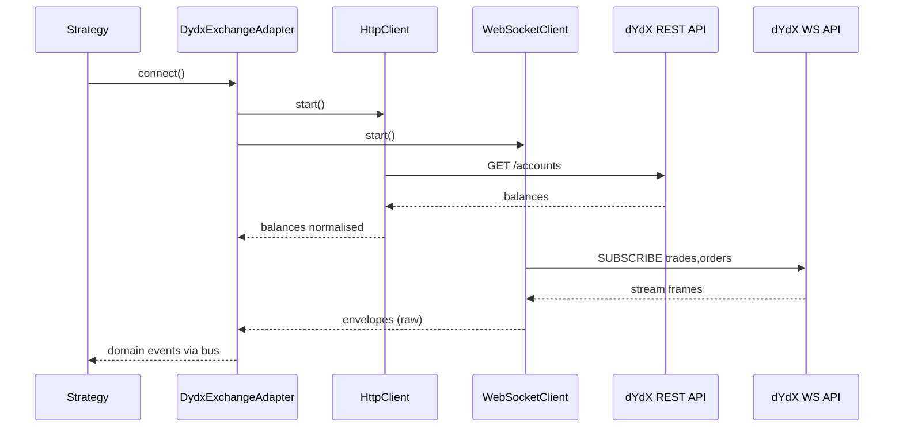

<!-- 1 · Component & Dependency Architecture -->


<!-- 2 · Order Classification & Life-cycle -->
```mermaid
flowchart TD
    A[New Order] -->|default| B[Short-term<br>(in-block)]
    A -->|DYDXOrderTags<br>is_short_term_order = false| C[Long-term]

    %% short-term branch
    B -->|optional: num_blocks_open| B1[Expires after N blocks]
    B --> B2[Committed only<br>fill & expiry]

    %% long-term branch
    C --> D{Conditional?}
    D -->|Yes&nbsp;(STOP_*)| C1[Long-term<br>Conditional]
    D -->|No| C2[Long-term<br>Regular]

    %% terminal
    B1 & B2 & C1 & C2 --> E[Filled / Cancelled / Expired]
```

<!-- 3 · End-to-End Order Submission Sequence -->




##### 1. File-/Module-level map (flowchart TD)

```mermaid
flowchart TD
    subgraph "nautilus_trader.adapters.dydx"
        A[__init__.py<br/>(re-exports)]
        B[config.py<br/>DydxConfig]
        C[common/*<br/>constants & helpers]
        D[endpoints/*<br/>(URL builders)]
        E[http/*<br/>HTTP client]
        F[websocket/*<br/>WS client]
        G[schemas/*<br/>Pydantic ↔ core]
        H[data.py<br/>Market-data adapters]
        I[execution.py<br/>Order logic]
        J[factories.py<br/>DydxAdapterFactory]
        K[providers.py<br/>DydxExchangeAdapter]
    end

    A --> K
    J --> K
    K --> B
    K --> C
    K --> D
    K --> E
    K --> F
    K --> G
    K --> H
    K --> I
    D --> E
    D --> F
```

##### 2. Runtime initialisation (sequence diagram)



##### 3. Live data / order-flow (left-to-right flowchart)

```mermaid
flowchart LR
    subgraph "dYdX"
        A1[WebSocket stream] -->|JSON frames| B1[Deserializer]
        A2[REST endpoint] ---.
    end

    B1 --> C[Normalizer<br/>(schemas/*)]
    A2 -.-> C

    C --> D[MessageBus]
    D --> E[Strategy]
    E --> F[OrderIntent]
    F --> G[OrderRouter<br/>(execution.py)]
    G --> H[HttpClient] & I[WebSocketClient]
    H -->|REST: place order| A2
    I -->|WS: private| A1
    D <-- G
```
