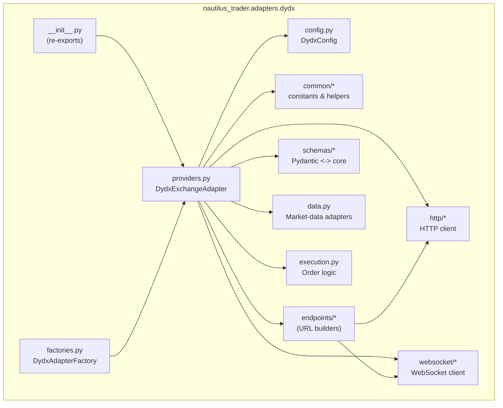
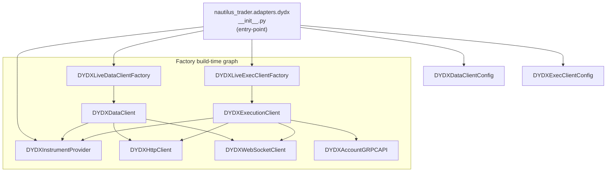
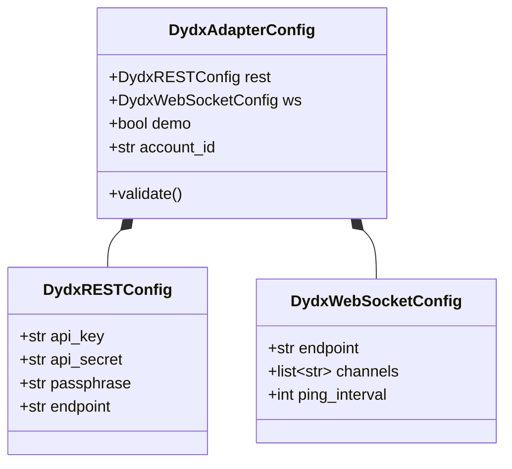
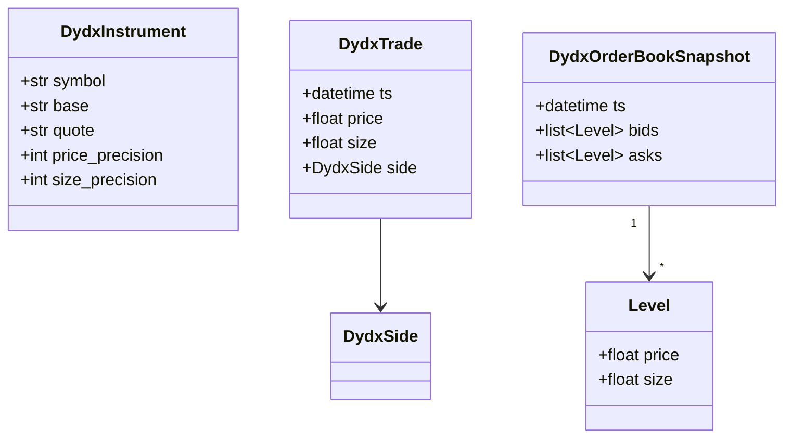
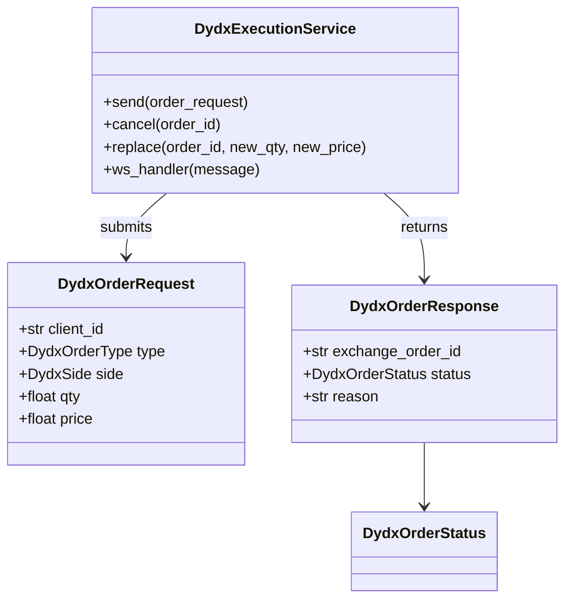

# Nautilus-Trader · dYdX Adapter — Diagram Suite  
(ordered top-down from architectural overview to detailed control-flow)

## 1. Package / Module Overview


---

## 2. Component & Dependency Architecture


---




---

## 4. Runtime Initialisation


---

## 5. Live Data & Order-Flow
```mermaid
flowchart LR
    subgraph "dYdX"
        A1[WebSocket stream] -->|JSON frames| B1[Deserializer]
        A2[REST endpoint]
    end

    B1 --> C[Normalizer<br/>(schemas/*)]
    A2 -.-> C

    C --> D[MessageBus]
    D --> E[Strategy]
    E --> F[OrderIntent]
    F --> G[OrderRouter<br/>(execution.py)]
    G --> H[HttpClient]
    G --> I[WebSocketClient]
    H -->|REST place order| A2
    I -->|WS private| A1
    G --> D
```

---

## 6. End-to-End Order Submission


---

## 7. Core Node & Strategy Classes


---

## 8. Factory Build-time Graph


---

## 9. Config Module


---

## 10. Factories Module


---

## 11. Enums Module


---

## 12. Providers Module


---

## 13. Data Module


---

## 14. Execution Module

